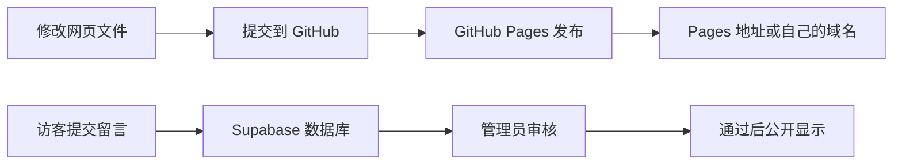
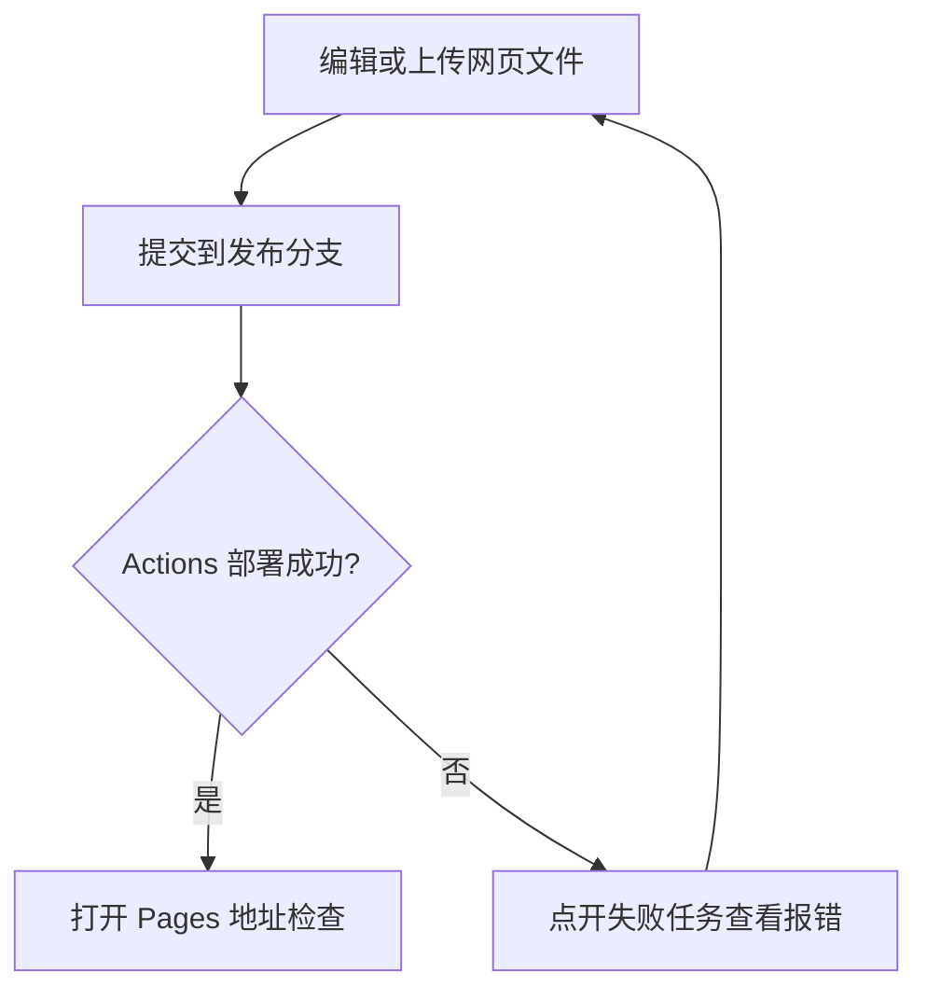
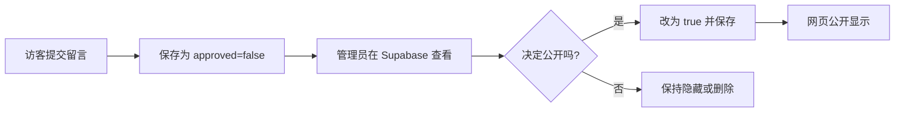

# GitHub Pages 静态网站与留言板部署教程

本教程介绍如何把 HTML、CSS 和 JavaScript 网站发布到 GitHub Pages，如何绑定自己的域名，以及如何使用 Supabase 保存和审核留言。步骤按第一次部署的顺序说明。

文中的“你的 GitHub 用户名”“你的仓库名”“你的域名”和 your-project-ref 都是占位示例，请替换成自己的信息。若你使用本仓库模板，文件名可照本教程；其他网站的文件名和目录可能不同。

## 先认识几个词

| 名称 | 简单解释 |
| --- | --- |
| 仓库（repository） | GitHub 上存放网站文件的项目空间。 |
| 分支（branch） | 仓库中的一条版本线；个人项目通常使用 main。 |
| GitHub Pages | GitHub 将仓库里的网页文件发布成可访问网站的服务。 |
| DNS | 域名的“地址簿”，告诉浏览器域名应该连接到哪里。 |
| Supabase | 提供数据库和 API 的服务；本教程用它保存留言。 |
| RLS | 数据库行级安全策略，用来限制访客能读写哪些数据。 |
| publishable key | 可放在网页前端的公开项目标识。它不是密码，实际权限由数据库授权和 RLS 控制。 |

## 整体流程



## 一、准备工作

开始前准备：

1. 一个 GitHub 账号，以及一个放有网站文件的仓库。
2. 仓库里有网页入口文件，通常叫 index.html。
3. 如果要启用留言板，需要一个 Supabase 账号。
4. 如果要绑定自己的域名，需要拥有该域名，并能打开域名服务商的 DNS 管理页面。没有域名也可以先用 GitHub Pages 提供的网址。

本模板的常用文件如下：

| 文件或目录 | 用途 |
| --- | --- |
| index.html | 主页内容和页面结构。 |
| about.html | 关于页面和留言表单。 |
| asset/css/ | 页面样式。 |
| asset/js/main.js | 主页交互和背景轮播。 |
| asset/js/guestbook.js | 留言提交、读取和展示。 |
| asset/js/guestbook-config.js | 留言板连接 Supabase 所需的公开配置。 |
| asset/image/ | 页面图片和图标。 |
| supabase/guestbook.sql | 创建留言表并设置访客权限的 SQL 脚本。 |
| CNAME | 使用自定义域名时，记录要绑定到 GitHub Pages 的域名。 |

## 二、先用 GitHub Pages 提供的网址发布

### 1. 确认文件位置

打开 GitHub 仓库，确认 index.html 位于仓库根目录（打开仓库后第一层），而不是误放在某个子文件夹。目录看起来通常像这样：

```text
你的仓库/
├── index.html
├── about.html
├── asset/
└── supabase/
```

如果网站文件放在 docs 等子文件夹，后面的 Pages 发布目录也要选那个文件夹。本模板默认网站文件在根目录。

### 2. 设置 Pages 发布源

1. 在仓库页面点击 Settings（设置）。如果看不到，确认自己有仓库管理权限。
2. 在左侧找到 Pages。
3. 找到 Build and deployment（构建与部署）区域，查看 Source（发布来源）。
4. 如果使用 Deploy from a branch（从分支部署），Branch 选 main，文件夹选 /(root)，再点击 Save。
5. 如果 Source 已经是 GitHub Actions，说明仓库可能使用自动化工作流部署。不要为了照抄本教程随意切换；保留现有方式并检查仓库中的 workflow 文件和 Actions 状态。

### 3. 等待发布并检查网站

1. 打开仓库顶部的 Actions，找到最新一次 Pages 部署任务。
2. 等待任务显示绿色成功标记。第一次发布可能需要几分钟。
3. 如果任务失败，点开它并查看第一个红色失败步骤和报错信息。
4. 回到 Settings → Pages，找到 GitHub 显示的网站地址并打开。
5. 检查主页能否正常显示。若有 about.html，也可在地址后加 /about.html 检查子页面。

个人主页仓库常命名为“你的 GitHub 用户名.github.io”，网址形式是 https://你的 GitHub 用户名.github.io/。普通项目仓库的网址通常还会带仓库名，例如 https://你的 GitHub 用户名.github.io/你的仓库名/。若普通项目站点的图片或样式加载失败，检查资源路径是否适配了仓库子路径。



### 4. 以后更新网页

修改文件后，把修改提交（Commit）到 Pages 正在使用的分支。GitHub 会自动重新部署。等 Actions 成功后刷新网页；浏览器还显示旧内容时，可尝试强制刷新（Windows 通常按 Ctrl + F5）。

在 GitHub 网页修改文件：打开文件，点铅笔图标，编辑后点 Commit changes。新增文件可点 Add file → Create new file。提交前检查文件路径，避免把 index.html 放到错误目录。

## 三、可选：绑定自己的域名

没有自己的域名可以跳过本节，直接使用 GitHub Pages 提供的网址。

### 1. 选定域名

假设你拥有 example.com，可以选择 www.example.com 或 home.example.com 作为网站地址。example.com 是文档示例，请换成自己的域名。先确定最终要使用的完整主机名，再配置 DNS 和 GitHub Pages。

### 2. 在域名服务商添加 DNS 记录

登录购买域名的服务商，打开该域名的 DNS 解析页面并添加记录。绑定子域名（例如 www.example.com）时，常见配置如下：

| 字段 | 示例值 | 说明 |
| --- | --- | --- |
| 记录类型 | CNAME | 子域名一般使用 CNAME。 |
| 主机记录 | www | 只填写子域名前缀。使用 home.example.com 时通常填 home。 |
| 记录值 / 指向 | 你的 GitHub 用户名.github.io | 填 GitHub Pages 主机名，不加 https://，也不加网页路径。 |
| TTL | 默认值 | 一般不需要修改。 |

保存后等待 DNS 生效。不同服务商和缓存的生效时间可能不同。若要绑定根域名（例如 example.com，不带 www），DNS 记录类型和配置方式可能不同，请查看 GitHub 自定义域名文档里的 apex domain 指引，不要直接照搬上面的子域名 CNAME 示例。

### 3. 在 GitHub Pages 中填写自定义域名

1. 回到仓库 Settings → Pages。
2. 在 Custom domain 输入完整域名，例如 www.example.com，然后点击 Save。
3. 在仓库根目录创建或修改名为 CNAME 的文件，文件内容只写完整域名一行，例如：

```text
www.example.com
```

不要写 https://、斜杠或网页路径。若 GitHub 保存 Custom domain 后自动创建了 CNAME 文件，就不必再建一个。

4. 等待 GitHub 检查 DNS 并配置 HTTPS 证书。
5. 证书就绪后，在 Settings → Pages 勾选 Enforce HTTPS。
6. 打开 https://www.example.com，并检查首页和子页面。

DNS 记录、GitHub Pages 的 Custom domain 和 CNAME 文件要填写同一个域名。仅添加 CNAME 文件不能代替其他两项设置。如果只是更新网页而域名没变，不要删除 CNAME 文件，也不需要重复添加 DNS 记录。

## 四、配置 Supabase 留言板

如果网站没有留言功能，可跳过本节。若已有 Supabase 项目，继续使用原项目就能保留已有留言。新建项目会有一套独立数据库，旧项目的数据不会自动复制过去。

### 1. 创建 Supabase 项目（第一次配置时）

1. 登录 Supabase Dashboard，点击 New project。
2. 选择或创建一个 Organization（组织）。
3. 填项目名称。
4. 设置数据库密码，并把它保存在密码管理器等私人安全位置。不要把密码写进网页代码或提交到 GitHub。
5. 选择离主要访客较近的 Region（区域）。
6. 选择适合自己的计划。若只是个人试用，可以查看是否有 Free 计划及其限制；价格、额度和选项以创建页面当时显示为准。
7. 点击创建并等待项目准备完成。

### 2. 创建留言表并配置权限

1. 在本仓库打开 supabase/guestbook.sql 文件，复制全部 SQL 内容。
2. 回到 Supabase 项目，在左侧点击 SQL Editor，创建新查询并粘贴 SQL。
3. 点击 Run 执行。执行完成后打开 Table Editor，在 public schema 下确认有 guestbook_messages 表。

这份 SQL 会创建留言表并开启 RLS。按模板设计，访客能提交姓名、邮箱和留言；新留言默认为待审核；访客只能读取通过审核的公开字段，不能读取邮箱，也不能修改审核状态。如果目标数据库已经有同名表或重要数据，不要盲目删除或重建；先备份并确认结构，再决定如何迁移。

### 3. 将 Supabase 项目连接到网页

1. 在 Supabase 项目设置中打开 API Keys；有些界面也能从 Connect 入口查看。
2. 找到 Project URL 和 Publishable key。URL 通常类似 https://your-project-ref.supabase.co，publishable key 以 sb_publishable_ 开头。
3. 打开 asset/js/guestbook-config.js，用自己的项目值替换占位内容：

```js
window.GUESTBOOK_CONFIG = Object.freeze({
  url: "https://your-project-ref.supabase.co",
  publishableKey: "sb_publishable_REPLACE_ME"
});
```

把 your-project-ref 换成自己的项目编号，把 sb_publishable_REPLACE_ME 换成 Dashboard 显示的完整 publishable key。保留引号、逗号和括号。保存并提交这个文件到 GitHub，等待 Pages 重新部署。

**安全提醒：** publishable key 本来就是给浏览器使用的，访客能从网页源码看到它；它不是数据库密码。不要把 Supabase secret key、旧版 service_role key、数据库密码、GitHub 密码或登录凭据写进 HTML、JavaScript、教程或公开仓库。数据库安全依靠正确的 grants 和 RLS，而不是把 publishable key 藏起来。请参考 [Supabase API Keys](https://supabase.com/docs/guides/getting-started/api-keys) 和 [Supabase RLS](https://supabase.com/docs/guides/database/postgres/row-level-security)。

### 4. 提交一条测试留言

1. 打开网站留言页面，填写名称、邮箱和留言内容并提交。
2. 页面提示已收到、审核后显示，说明留言已提交；此时它通常不会公开显示。
3. 回到 Supabase 的 Table Editor → guestbook_messages，检查是否出现新行。
4. 确认 approved 当前为 false。审核通过后再改为 true。

若页面提示留言服务尚未配置，检查 guestbook-config.js 是否已提交并完成 Pages 部署。若连接失败，检查 Project URL、publishable key、SQL 是否成功执行，以及表名是否为 guestbook_messages。

## 五、以后如何审核留言

1. 登录 Supabase Dashboard，打开对应项目。
2. 左侧选择 Table Editor，进入 public schema 下的 guestbook_messages 表。
3. 找到 approved 为 false 的行，这些是待审核留言。查看名称和内容，再决定是否公开。
4. 要公开的留言，将该行 approved 改为 true 并保存。Table Editor 的界面版本可能不同，可能需要编辑单元格或打开行编辑面板；留意保存按钮或确认图标。
5. 不公开的留言保持 false，或删除该行。删除后不能通过网站恢复。
6. 刷新网站留言页面，通过审核的留言就会显示。

访客只能看到审核通过的姓名、留言和日期；邮箱保存在数据库中，有项目管理权限的人可在后台查看。留言内容由访客填写，公开前要确认里面没有不适合公开的个人信息或链接。



## 六、常见问题

| 现象 | 优先检查 |
| --- | --- |
| Pages 地址显示 404 | 发布源、分支和目录是否选对？发布目录里有没有 index.html？最近一次 Actions 部署成功了吗？ |
| 页面能打开但图片或样式缺失 | 文件是否提交？路径大小写是否一致？项目站点的资源路径是否适配仓库子路径？ |
| 自定义域名打不开 | DNS 主机记录和目标是否正确？Pages 的 Custom domain 是否填写了相同域名？CNAME 文件是否只有这个域名？DNS 是否还在传播？ |
| HTTPS 不可用 | 等待 DNS 和证书配置完成，再查看 Settings → Pages 的 HTTPS 状态。 |
| 留言提交失败 | 检查 Supabase URL、publishable key、留言表、SQL 执行结果，以及浏览器网络错误。 |
| 提交成功但页面没有留言 | 这是审核机制的预期结果。到 Table Editor 检查记录，确认后将 approved 改为 true。 |
| 页面说没有公开留言 | 检查是否有 approved=true 的记录，以及读取请求是否成功；待审核记录不会显示。 |

## 七、重新部署检查清单

- [ ] index.html 位于 GitHub Pages 发布目录。
- [ ] Settings → Pages 的发布源、分支和目录正确。
- [ ] 最新一次 Pages 部署成功，主页及子页面都能打开。
- [ ] 若使用自定义域名，DNS、Custom domain 和 CNAME 文件内容一致。
- [ ] 若使用新 Supabase 项目，已创建留言表、执行 SQL 并更新网页配置。
- [ ] 没有把 secret key、service_role key、数据库密码或账号凭据放进公开仓库。
- [ ] 实际提交一条留言，确认它先待审核，通过审核后才显示。

## 官方参考

- [GitHub Pages：配置发布源](https://docs.github.com/en/pages/getting-started-with-github-pages/configuring-a-publishing-source-for-your-github-pages-site)
- [GitHub Pages：配置自定义域名](https://docs.github.com/en/pages/configuring-a-custom-domain-for-your-github-pages-site)
- [Supabase：创建和管理数据表](https://supabase.com/docs/guides/database/tables)
- [Supabase：API Keys](https://supabase.com/docs/guides/getting-started/api-keys)
- [Supabase：Row Level Security](https://supabase.com/docs/guides/database/postgres/row-level-security)
